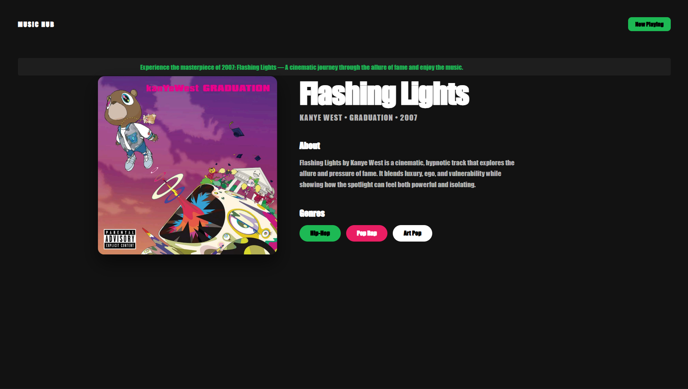

# 🎵 Song Card - Pavazha Malli

A stylish, interactive music player card built using **HTML** and **CSS**. This project was developed as a task to demonstrate UI design skills and basic interactivity.

 
## Features
* **Responsive Design:** Beautifully crafted card layout.
* **Spotify Integration:** Clicking the "Now Playing" button redirects you to the song "Pavazha Malli" on Spotify.
* **Clean UI:** Minimalist aesthetic with a focus on typography and spacing.

##  Tech Stack
* **HTML5:** Structure of the card.
* **CSS3:** Styling, centering, and hover effects.

##  Preview
 
*(Note: Replace this with an actual screenshot link or delete this line)*

##  Live Link
[View the Project](https://adhieeeh.github.io/Song-Card/) 
*(Make sure to enable GitHub Pages in your repo settings!)*

##  How to Access 
1. Clone the repository:
   `git clone https://github.com/Adhieeeh/Song-Card.git`
2. Open `index.html` in your browser.
3. Click the **Now Playing** button to jump to the track on Spotify.
